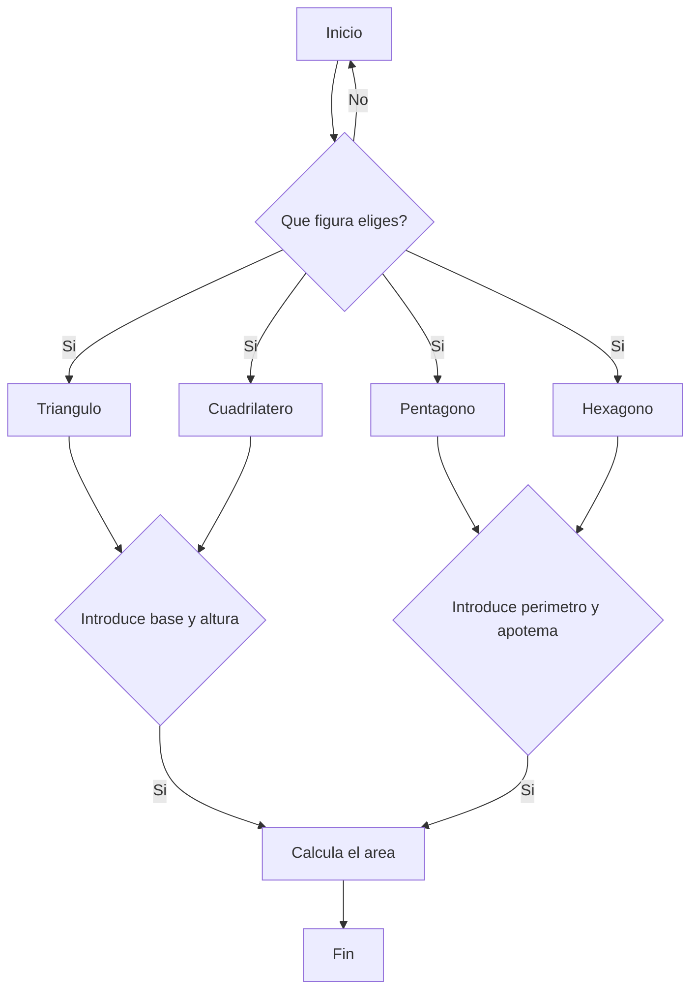

```mermaid
graph TD;
A[Inicio] --> B{Que figura eliges?}
B-->|Si|C
B-->|No|A
C[Triangulo]
B-->|Si|D
D[Cuadrilatero]
B-->|Si|E
E[Pentagono]
B-->|Si|F
F[Hexagono]
C--> G{Introduce base y altura}
D--> G{Introduce base y altura}
E--> H{Introduce perimetro y apotema}
F--> H{Introduce perimetro y apotema}
G-->|Si|I
H-->|Si|I
I[Calcula el area]
I--> J[Fin]


```